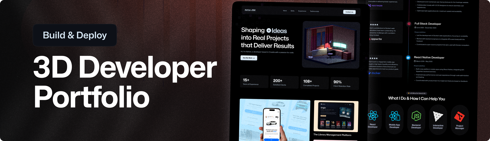

# Interactive 3D Portfolio - Vikash Kumar

Welcome to my personal 3D Portfolio project! This website is a highly engaging, interactive showcase of my technical skills, professional experience, and projects. It features animated 3D scenes, smooth camera transitions, and a modern, responsive design.

<div align="center">
    
</div>

---

## 🤖 Introduction

This project was built to represent my identity as a developer in a visually striking way. It combines cutting-edge web technologies like **React** and **Three.js** to create an immersive experience that goes beyond a traditional static resume. 

I developed this project by following and customizing a comprehensive tutorial from **Adrian Hajdin (JavaScript Mastery)**. Throughout the process, I modified the original template to reflect my personal branding, updated the tech stack icons (including adding a custom animated C++ logo), and tailored the content to highlight my specific achievements in Data Structures, Algorithms, and Full-Stack development.

---

## ⚙️ Tech Stack

- **React 19**: Frontend framework for building the UI.
- **Three.js**: A powerful library for rendering 3D graphics in the browser.
- **React Three Fiber & Drei**: React-based wrappers for Three.js that make working with 3D models seamless.
- **GSAP (GreenSock Animation Platform)**: Used for high-performance scroll-triggered and reveal animations.
- **Tailwind CSS**: Utility-first CSS framework for styling and responsive design.
- **Vite**: Modern build tool for a fast development experience.
- **EmailJS**: Integrated for a functional contact form without needing a backend.

---

## 🔋 Features

- **Animated 3D Models**: Immersive scenes featuring optimized 3D models with realistic lighting and shadows.
- **Custom Tech Stack**: A personalized skills section with floating 3D icons and a custom-built 3D image card for the C++ logo.
- **Interactive Achievement Boxes**: Dynamic counters highlighting key milestones (e.g., 200+ LeetCode problems, 6+ Technical Projects).
- **Smooth Navigation**: GSAP-powered transitions and scroll-triggered reveal animations.
- **Fully Responsive**: Optimized for desktop, tablet, and mobile devices to ensure a consistent 3D experience.
- **Functional Contact Form**: Direct communication via EmailJS integration.

---

## 🤸 Quick Start

To run this project locally, follow these steps:

### Prerequisites
- [Node.js](https://nodejs.org/) installed on your machine.
- [npm](https://www.npmjs.com/) or [yarn](https://yarnpkg.com/) for package management.

### Installation
1. Clone the repository:
   ```bash
   git clone https://github.com/Vikash-Kumar-23/Portfolio.git
   cd Portfolio
   ```
2. Install dependencies:
   ```bash
   npm install
   ```
3. Set up Environment Variables:
   Create a `.env` file in the root directory and add your EmailJS credentials:
   ```env
   VITE_APP_EMAILJS_SERVICE_ID=your_service_id
   VITE_APP_EMAILJS_TEMPLATE_ID=your_template_id
   VITE_APP_EMAILJS_PUBLIC_KEY=your_public_key
   ```
4. Run the development server:
   ```bash
   npm run dev
   ```

---

## ✍️ Credits & Acknowledgments

This project was made possible thanks to the excellent educational content provided by **Adrian Hajdin** at **JavaScript Mastery**. 

- **Original Tutorial**: [Build a Modern 3D Portfolio Website](https://www.youtube.com/watch?v=E-fdPfRxkzQ)
- **YouTube Channel**: [JavaScript Mastery](https://www.youtube.com/@javascriptmastery)

I highly recommend his tutorials for anyone looking to master modern web development and 3D web design.

---

## 🚀 About Me

I am **Vikash Kumar**, a developer passionate about building high-quality, scalable, and visually appealing web applications. Feel free to explore my code and reach out if you'd like to collaborate!

**Happy Coding!** 💻✨
